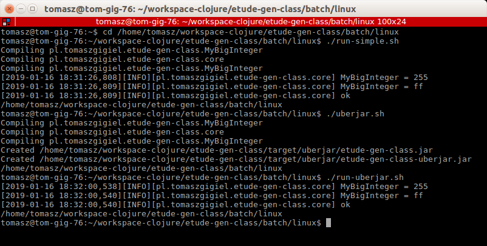

# etude-gen-class

":gen-class" in Clojure.

## Usage

java -jar /path/to/etude-gen-class-uberjar.jar

## Notice

Note the instances of the MyBigInteger string in:
* core.clj (:import)
* MyBigInteger.clj (:gen-class)
* project.clj (:aot)

and target classes.

## License

Copyright © 2018 Tomasz Gigiel

Distributed under the Apache License, Version 2.0.
